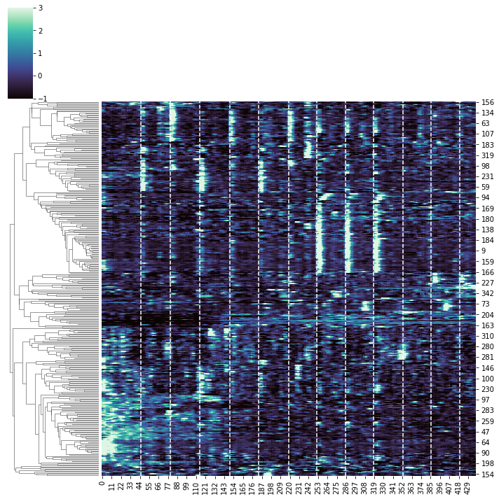
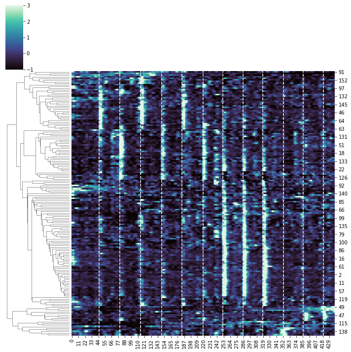
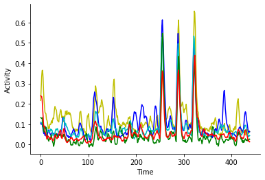

**Can we find identify functionally distinct neurons by using clustering and linear regression?**

**Answer: Yes. This approach reveals functionally distinct neuronal classes. See below Notebook or Repository link**


## Repository Link

<a href="https://github.com/amgfernandes/Imaging_analysis"> Neuronal imaging </a>


Brief description of the approach to answer the question:

Inspired by Miri et al., 2011, a regressor-based ROI analysis of the imaging data was performed.

Regressors are generated with time series that are set to zero for all time points except the time points of stimulation, which are set to one (visual stimuli in this case are Prey-like, Looming and Dimming). The regressors are then convolved with a kernel describing the GCaMP response function.

A linear regression approach (using Python scikit-learn) was used to select neurons, removing neurons with activity not locked to stimulus presentation (spontaneously active).

Extracted neurons were clustered using hierarchical clustering (agglomerative approach with Python scipy.cluster.hierarchy.linkage) for visualization of response types.

The maximum score of either the prey-like stimuli (nasalward and temporalward), looming or dimming stimuli was used to assign ROIs to specific response types.

References:


Miri, A., Daie, K., Burdine, R.D., Aksay, E., and Tank, D.W. (2011). Regression-based identification of behavior-encoding neurons during large-scale optical imaging of neural activity at cellular resolution. J. Neurophysiol. 105, 964–980.

António M. Fernandes, Johannes Larsch, Joseph C. Donovan, Thomas O. Helmbrecht, Duncan Mearns, Yvonne Kölsch, Marco Dal Maschio, Herwig Baier bioRxiv 598383; doi: https://doi.org/10.1101/598383

Related to Fernandes et. al 2019:
<a href="https://www.biorxiv.org/content/10.1101/598383v1"> Neuronal circuitry for stimulus selection in the visual system</a>.


Some of the helper functions were written with the help of Joe Donovan (https://github.com/joe311), Vilim Štih(https://github.com/vilim) and Thomas Helmbrecht.


---

```python
__author__ = 'Fernandes'
%load_ext autoreload
%autoreload 2
###################### IMPORT LIBRARIES################################ '''

import os
from Miguel_load_exp_Femtonics_python3 import *
import matplotlib.pyplot as plt
import numpy as np
from filepicker_python3 import *
import shelve
import time
import seaborn as sns
import pickle
import sys
from sklearn import linear_model, metrics  
from filepicker_python3 import pickfiles
from ipywidgets import interact
from helper_functions_imaging import *
```


```python
'''Region of sensor used (GCaMP)'''
GCaMP = 'gcamp6s'


'''Region of the brain imaged'''
regions=['right_tectum'] #can run over multiple regions
```


```python
''' ###################### Loading The Files ####################### '''
reg_path=('/Users/fernandes/Dropbox (Personal)/Github_Migas/Neuronal_imaging/example_ROIs.p')
print (reg_path)
```

    /Users/fernandes/Dropbox (Personal)/Github_Migas/Neuronal_imaging/example_ROIs.p


```python
for region in regions:

    '''Load files'''
    print (region)
    print ('Loading...')
    tload1 = time.time()
    Exp_MF = load_experiment_w_pickle_new_femtonics_2019(reg_path, corrected=False)
    tload2 = time.time()
    tload = tload2 - tload1
    print ('Done - Time for Image Loading:', tload)
    print ('Image - Dimensions:', np.shape(Exp_MF.images))
    try:
        filename = Exp_MF.metadata['Experiment code']+'_'+Exp_MF.metadata['Fish name']+'_'+Exp_MF.metadata['Recording name']+'_'+Exp_MF.metadata['Visual Stim']
    except:
        filename = Exp_MF.metadata['Experiment code']+'_'+Exp_MF.metadata['Fish name']+'_'+Exp_MF.metadata['Recording name']+'_'+Exp_MF.metadata['Visual Stimulation']
    filename_dir = os.path.dirname(reg_path) +'/'+ filename

    '''Take shelve file with extracted ROIs'''
    curr_path=str(os.path.dirname(reg_path))
    os.chdir(curr_path)
    file_shelve = os.path.dirname(reg_path) + '/' + Exp_MF.metadata['Recording name'].replace("M", "F")+'_UGf_ROIs'+'_'+ str(region)+'.shv'
    shelvename = file_shelve

    analysed_shv = shelve.open(os.path.basename(os.path.normpath(file_shelve)), protocol=2)

    ROI_settings = analysed_shv['settings'] #if shelve cannot be read pass everything and move on to next file

    metadata = Exp_MF.metadata #take metadata
    protocol = Exp_MF.stimuli

    frame_rate = float(1 / Exp_MF.dt)

    '''which GCaMP used?'''
    if GCaMP == 'gcamp6s':
        print ('GCamP6s used')
        exp_decay_kernel = Exp_MF.exp_decay_kernel_g6s()
    if GCaMP == 'gcamp6f':
        exp_decay_kernel = Exp_MF.exp_decay_kernel_g6f()


    ''' ###################### Building Regressors ##################################################################### '''      

    stim1_main=np.where(Exp_MF.stimuli['stim1_presence']>0)
    stim2_main=np.where(Exp_MF.stimuli['stim2_presence']>0)
    stim3_main=np.where(Exp_MF.stimuli['stim3_presence']>0)

    t=Exp_MF.stimuli['t'] #t is time from protocol file

    reg_stim1=make_reg(regressor_to_make=stim1_main, steps=Exp_MF.steps,t=t,frame_rate=frame_rate)
    reg_stim2=make_reg(regressor_to_make=stim2_main, steps=Exp_MF.steps,t=t,frame_rate=frame_rate)
    reg_stim3=make_reg(regressor_to_make=stim3_main, steps=Exp_MF.steps,t=t,frame_rate=frame_rate)

    reg_stim1_high = find_timepoints_reg_high(reg_stim1)
    reg_stim2_high = find_timepoints_reg_high(reg_stim2)
    reg_stim3_high = find_timepoints_reg_high(reg_stim3)
    reg_all_high=np.concatenate((reg_stim1_high[0],reg_stim2_high[0],reg_stim3_high[0]))


    '''Convolve regressors'''

    reg_stim1_conv = (Exp_MF.convolve_regressors(reg_stim1,exp_decay_kernel))
    reg_stim2_conv = (Exp_MF.convolve_regressors(reg_stim2,exp_decay_kernel))
    reg_stim3_conv = (Exp_MF.convolve_regressors(reg_stim3,exp_decay_kernel))


    reg_stim1_high = find_timepoints_reg_high(reg_stim1)
    reg_stim2_high = find_timepoints_reg_high(reg_stim2)
    reg_stim3_high = find_timepoints_reg_high(reg_stim3)


    '''remove ROIs based on regression that are not locked to any stim (regressors)'''
#https://scikit-learn.org/stable/modules/generated/sklearn.linear_model.LinearRegression.html
    reg = linear_model.LinearRegression()


    analysed_shv['ROI_traces_deltaF_F0']=dFoverF_ROIs(analysed_shv['ROI_traces'])
    ROIs_seed_deltaF_F0=analysed_shv['ROI_traces_deltaF_F0']
    regs_conv = np.asarray([reg_stim1_conv,reg_stim2_conv,reg_stim3_conv])
    regs_timepoints =  [reg_stim1_high,reg_stim2_high,reg_stim3_high] #timepoints for regressors

    r2_threshold=0.05#'''regression threshold for ROIs'''
    '''fit for all regressors and then take the r2, remove all ROIs that are not highly correlated'''
    idx,r2,coefs = filter_rois(regs_conv, ROIs_seed_deltaF_F0, r2_threshold,reg) #filter spontaneous away ROIs
    '''ROIs_seed_deltaF_F0[idx , :] #filtered ROIs'''
    activity_ROIs_filt=mean_for_timepoints_with_ROIs(ROIs_seed_deltaF_F0[idx , :], regs=regs_timepoints, how_long=5) #how many frames

    '''#if ROIs pass threshold'''

    if r2.max()>r2_threshold: #only if ROIS pass threshold of r2
        df_save=pd.DataFrame(activity_ROIs_filt)

        keys_stim = ['prey', 'looming', 'dimming']
        df_save.columns=keys_stim
        df_metadata=pd.Series(metadata)


        '''filter neurons by class [idx,:]'''
        coef_stim1_filt=coefs[idx,:][:,0] #for prey
        coef_stim2_filt=coefs[idx,:][:,1] #for loomming
        coef_stim3_filt=coefs[idx,:][:,2] #for dimming

        max_correlation_values_found=max_correlation_values(coef_stim1_filt,coef_stim2_filt,coef_stim3_filt) #find maximum value for each regressor

        prey_rois=np.where(coef_stim1_filt==max_correlation_values_found)
        looming_rois=np.where(coef_stim2_filt==max_correlation_values_found)
        dimming_rois=np.where(coef_stim3_filt==max_correlation_values_found)

        prey_rois_to_save=ROIs_seed_deltaF_F0[idx][prey_rois]
        looming_rois_to_save=ROIs_seed_deltaF_F0[idx][looming_rois]
        dimming_rois_to_save=ROIs_seed_deltaF_F0[idx][dimming_rois]

        analysed_shv.close() #close shelve file


print ('DONE ALL FILES')


```

    right_tectum
    Loading...
    Done - Time for Image Loading: 5.382801055908203
    Image - Dimensions: (439, 345, 559)
    GCamP6s used
    DONE ALL FILES


# Metadata from experiment


```python
metadata
```


    {'Experiment code': 'MF343',
     'Recording name': 'M4',
     'Visual Stimulation': 'Prey vs Looming vs Dimming',
     'Fish name': 'gad1bgalUAS NTRmch HucnlsG6s left eye PRE',
     'Date_Time': 'd_20200117_ t_113240',
     'Imaging time': '420 sec',
     'Imaging rate': '1Hz 1 plane',
     'Notes_': 'monocular'}


```python
ROIs_seed_deltaF_F0
```


    array([[1.30372351, 1.33589399, 1.35685345, ..., 0.22421512, 0.23576057,
            0.25036587],
           [0.68697448, 0.66299846, 0.73401614, ..., 0.12826612, 0.13901776,
            0.12742805],
           [0.6562971 , 0.59936269, 0.60723362, ..., 0.03472879, 0.03139012,
            0.02547576],
           ...,
           [0.27760876, 0.23184323, 0.22601176, ..., 0.08066913, 0.06958619,
            0.04749682],
           [0.11212086, 0.10181155, 0.11130001, ..., 0.04471489, 0.04416309,
            0.02516504],
           [0.06415005, 0.06092715, 0.06942013, ..., 0.04961192, 0.05060839,
            0.06207445]])


```python
'''Array of r2 scores'''
sns.distplot(r2)
```


    <matplotlib.axes._subplots.AxesSubplot at 0x1a22a73470>


# Clustering all neurons
White lines: stimulus presentation


```python
result=sns.clustermap(ROIs_seed_deltaF_F0[:], metric="correlation", cmap="mako",col_cluster=False,\
   robust=True, figsize=(10,10), z_score=0,vmin=-1, vmax=3);
xposition = reg_all_high
ax = result.ax_heatmap
for xc in xposition:
    ax.axvline(x=xc, color='w', linestyle='--')
```

    /Users/fernandes/anaconda3/lib/python3.7/site-packages/seaborn/matrix.py:624: UserWarning: Clustering large matrix with scipy. Installing `fastcluster` may give better performance.
      warnings.warn(msg)





```python
'''Save all Neurons'''
all_rois_df=pd.DataFrame(ROIs_seed_deltaF_F0)
all_rois_df.to_csv('all_rois_df.csv')
```

# Clustering selected neurons.
Removed neurons that are not locked to stimuli.
White lines: stimulus presentation


```python
result=sns.clustermap(ROIs_seed_deltaF_F0[idx], metric="correlation", cmap="mako",col_cluster=False,\
   robust=True, figsize=(10,10), z_score=0,vmin=-1, vmax=3);    
ax = result.ax_heatmap
for xc in xposition:
    ax.axvline(x=xc, color='w', linestyle='--')
```





```python
'''Save selected Neurons'''
rois_r2_pass=pd.DataFrame(ROIs_seed_deltaF_F0[idx])
rois_r2_pass
rois_r2_pass.to_csv('rois_r2_pass.csv')
```


```python
'''Plot some example neurons'''
color_roi=['y','b','c','g','r']
for c, neuron in enumerate(ROIs_seed_deltaF_F0[idx][5:10]):
    plt.plot(neuron, color=color_roi[c])
    plt.xlabel('Time')
    plt.ylabel('Activity')
    sns.despine()
```





# Check all selected neurons


```python
@interact
def showTraces(roi:(0,ROIs_seed_deltaF_F0[idx].shape[0])):
    fig,ax =plt.subplots(figsize=(10,5))
    plt.plot(ROIs_seed_deltaF_F0[roi], color='k')
    p0=plt.plot(reg_stim1_conv, lw=1, color='orange' )
    p1=plt.plot(reg_stim2_conv, lw=1, color='fuchsia')
    p2=plt.plot(reg_stim3_conv, lw=1, color='turquoise')
    ax.legend((p0[0], p1[0],p2[0]), ('Prey', 'Looming', 'Dimming'), bbox_to_anchor=(1,1))
    sns.despine()
```


    interactive(children=(IntSlider(value=81, description='roi', max=163), Output()), _dom_classes=('widget-intera…


# Check Prey-responsive neurons


```python
@interact
def showTraces(roi:(0,prey_rois_to_save.shape[0]-1)):
    fig,ax =plt.subplots(figsize=(10,5))
    p0=plt.plot(reg_stim1_conv, lw=1, color='orange' )
    p1=plt.plot(reg_stim2_conv, lw=1, color='fuchsia')
    p2=plt.plot(reg_stim3_conv, lw=1, color='turquoise')
    ax.legend((p0[0], p1[0],p2[0]), ('Prey', 'Looming', 'Dimming'), bbox_to_anchor=(1,1))
    sns.despine()
    plt.plot(prey_rois_to_save[roi], color='k')
```


    interactive(children=(IntSlider(value=27, description='roi', max=54), Output()), _dom_classes=('widget-interac…


# Check Looming-responsive neurons


```python
from ipywidgets import interact
@interact
def showTraces(roi:(0,looming_rois_to_save.shape[0]-1)):
    fig,ax =plt.subplots(figsize=(10,5))
    p0=plt.plot(reg_stim1_conv, lw=1, color='orange' )
    p1=plt.plot(reg_stim2_conv, lw=1, color='fuchsia')
    p2=plt.plot(reg_stim3_conv, lw=1, color='turquoise')
    ax.legend((p0[0], p1[0],p2[0]), ('Prey', 'Looming', 'Dimming'), bbox_to_anchor=(1,1))
    sns.despine()
    plt.plot(looming_rois_to_save[roi], color='k')
```


    interactive(children=(IntSlider(value=45, description='roi', max=91), Output()), _dom_classes=('widget-interac…


# Check Dimming-responsive neurons


```python
from ipywidgets import interact
@interact
def showTraces(roi:(0,dimming_rois_to_save.shape[0]-1)):
    fig,ax =plt.subplots(figsize=(10,5))
    p0=plt.plot(reg_stim1_conv, lw=1, color='orange' )
    p1=plt.plot(reg_stim2_conv, lw=1, color='fuchsia')
    p2=plt.plot(reg_stim3_conv, lw=1, color='turquoise')
    ax.legend((p0[0], p1[0],p2[0]), ('Prey', 'Looming', 'Dimming'), bbox_to_anchor=(1,1))
    sns.despine()
    plt.plot(dimming_rois_to_save[roi], color='k')
```


    interactive(children=(IntSlider(value=7, description='roi', max=15), Output()), _dom_classes=('widget-interact…
