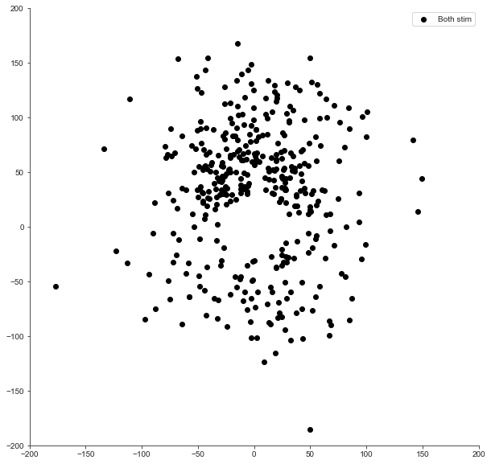
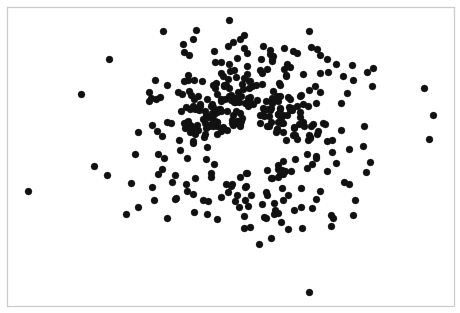
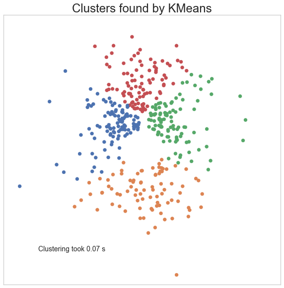
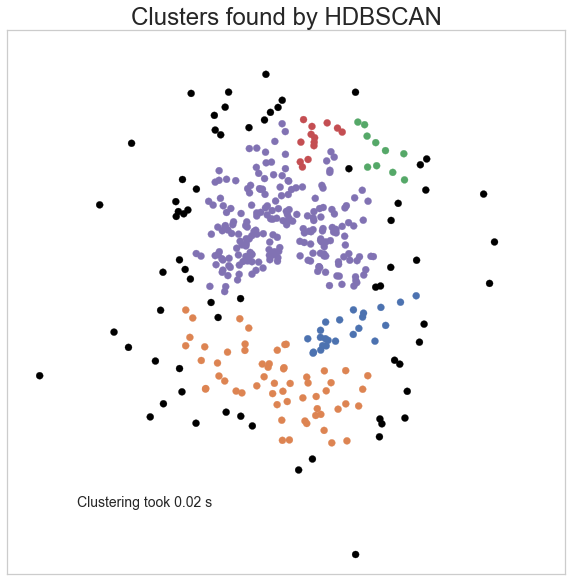

Trying out unsupervised clustering

## Repository Link
<!-- https://github.com/amgfernandes/Behavioral_analysis/blob/master/Unsupervised_clustering -->

<a href="https://github.com/amgfernandes/Behavioral_analysis/blob/master/Unsupervised_clustering/"> Clustering </a>


```python
import pandas as pd
import matplotlib.pyplot as plt
import numpy as np
import seaborn as sns
import scipy.stats as sta
from itertools import groupby
import os
import glob

%reload_ext autoreload
%autoreload 2
%matplotlib inline

```


```python
import sys
print("Python version")
print (sys.version)
```

    Python version
    3.7.2 (default, Dec 29 2018, 00:00:04)
    [Clang 4.0.1 (tags/RELEASE_401/final)]


# Specify file containing behavioral data


```python
df=pd.read_csv('MF319_competition_3_conditions_df_.csv', index_col=0)
df.head()
```


<div>
<style scoped>
    .dataframe tbody tr th:only-of-type {
        vertical-align: middle;
    }

    .dataframe tbody tr th {
        vertical-align: top;
    }

    .dataframe thead th {
        text-align: right;
    }
</style>
<table border="1" class="dataframe">
  <thead>
    <tr style="text-align: right;">
      <th></th>
      <th>animalID</th>
      <th>c1</th>
      <th>c2</th>
      <th>condition</th>
      <th>e</th>
      <th>expAnimal</th>
      <th>experiment</th>
      <th>frame</th>
      <th>frameCont</th>
      <th>l</th>
      <th>...</th>
      <th>yp2</th>
      <th>treatment</th>
      <th>xOriginal</th>
      <th>yOriginal</th>
      <th>front</th>
      <th>right</th>
      <th>left</th>
      <th>r</th>
      <th>centerDist</th>
      <th>lastStep</th>
    </tr>
  </thead>
  <tbody>
    <tr>
      <th>0</th>
      <td>0.0</td>
      <td>1.0</td>
      <td>0.0</td>
      <td>4</td>
      <td>1.0</td>
      <td>0.0</td>
      <td>0.0</td>
      <td>0.0</td>
      <td>2800.0</td>
      <td>0.0</td>
      <td>...</td>
      <td>0.630044</td>
      <td>0</td>
      <td>235.0</td>
      <td>430.0</td>
      <td>0.0</td>
      <td>0.0</td>
      <td>0.0</td>
      <td>-0.000000</td>
      <td>0.0</td>
      <td>0.0</td>
    </tr>
    <tr>
      <th>1</th>
      <td>0.0</td>
      <td>1.0</td>
      <td>0.0</td>
      <td>4</td>
      <td>1.0</td>
      <td>0.0</td>
      <td>0.0</td>
      <td>1.0</td>
      <td>2801.0</td>
      <td>0.0</td>
      <td>...</td>
      <td>0.630044</td>
      <td>0</td>
      <td>235.0</td>
      <td>430.0</td>
      <td>0.0</td>
      <td>0.0</td>
      <td>0.0</td>
      <td>-0.000000</td>
      <td>0.0</td>
      <td>0.0</td>
    </tr>
    <tr>
      <th>2</th>
      <td>0.0</td>
      <td>1.0</td>
      <td>0.0</td>
      <td>4</td>
      <td>1.0</td>
      <td>0.0</td>
      <td>0.0</td>
      <td>2.0</td>
      <td>2802.0</td>
      <td>0.0</td>
      <td>...</td>
      <td>0.630044</td>
      <td>0</td>
      <td>234.0</td>
      <td>430.0</td>
      <td>1.0</td>
      <td>0.0</td>
      <td>1.0</td>
      <td>1.834389</td>
      <td>1.0</td>
      <td>1.0</td>
    </tr>
    <tr>
      <th>3</th>
      <td>0.0</td>
      <td>1.0</td>
      <td>0.0</td>
      <td>4</td>
      <td>1.0</td>
      <td>0.0</td>
      <td>0.0</td>
      <td>3.0</td>
      <td>2803.0</td>
      <td>0.0</td>
      <td>...</td>
      <td>0.630044</td>
      <td>0</td>
      <td>234.0</td>
      <td>430.0</td>
      <td>1.0</td>
      <td>0.0</td>
      <td>1.0</td>
      <td>1.834389</td>
      <td>1.0</td>
      <td>0.0</td>
    </tr>
    <tr>
      <th>4</th>
      <td>0.0</td>
      <td>1.0</td>
      <td>0.0</td>
      <td>4</td>
      <td>1.0</td>
      <td>0.0</td>
      <td>0.0</td>
      <td>4.0</td>
      <td>2804.0</td>
      <td>0.0</td>
      <td>...</td>
      <td>0.630044</td>
      <td>0</td>
      <td>234.0</td>
      <td>430.0</td>
      <td>1.0</td>
      <td>0.0</td>
      <td>1.0</td>
      <td>1.834389</td>
      <td>1.0</td>
      <td>0.0</td>
    </tr>
  </tbody>
</table>
<p>5 rows × 31 columns</p>
</div>


```python
df.columns
```


    Index(['animalID', 'c1', 'c2', 'condition', 'e', 'expAnimal', 'experiment',
           'frame', 'frameCont', 'l', 'o', 's1', 's1b', 's2', 's2b', 'trial', 'x',
           'xp1', 'xp2', 'y', 'yp1', 'yp2', 'treatment', 'xOriginal', 'yOriginal',
           'front', 'right', 'left', 'r', 'centerDist', 'lastStep'],
          dtype='object')


```python
df.condition.unique()
```


    array([4, 7, 1])


```python
df.trial.max()
```


    300.0


```python
#specify time limits for analysis, i.e. to exclude very late trials
first_trial=0
last_trial=300

#pull only trials within time limits
dfEarly=df[(df.trial<last_trial)&(df.trial>first_trial)]

#generate a unique ID from animalID and trial number
dfEarly.loc[:,'anTrial']=dfEarly.trial.values + dfEarly.animalID.values*dfEarly.trial.values.max()

# #only consider animals that moved by more than a threshold
ResponseThreshold=30  #should be  around 4mm according to calculations.

ind=(dfEarly.centerDist>=ResponseThreshold)&(dfEarly.frame<=dfEarly.frame.max())
d=dfEarly[ind]

```


```python
last_frame_stim=15 #last frame for looming presentation for each tRial. End of expansion
```


```python
#condition 1 is coNdition with right stimu only
#condition 4 is coNdition  with left stimu only
#condition 7 is coNdition with both stimuli (equal stim competition)


x_right_stim=d.x[(d.condition==1)&(d.frame==last_frame_stim)]
y_right_stim=d.y[(d.condition==1)&(d.frame==last_frame_stim)]
x_left_stim=d.x[(d.condition==4)&(d.frame==last_frame_stim)]
y_left_stim=d.y[(d.condition==4)&(d.frame==last_frame_stim)]
x_competition=d.x[(d.condition==7)&(d.frame==last_frame_stim)]
y_competition=d.y[(d.condition==7)&(d.frame==last_frame_stim)]


right_stim=np.stack([x_right_stim,y_right_stim])
left_stim=np.stack([x_left_stim,y_left_stim])
both_stim=np.stack([x_competition,y_competition])

```


```python
'''Condition with right or left stimuli alone'''

fig = plt.figure(figsize= (10, 10))
plt.scatter(right_stim[0],right_stim[1], color='g',label='right loom')
plt.scatter(left_stim[0],left_stim[1], color='m',label='left loom')
plt.legend(loc='upper right')
plt.xlim(-200,200)
plt.ylim(-200,200)
sns.despine()


```


```python
'''Condition with both stimuli'''

fig = plt.figure(figsize= (10, 10))
plt.scatter(both_stim[0],both_stim[1], color='k', label= 'Both stim')
plt.legend(loc='upper right')
plt.xlim(-200,200)
plt.ylim(-200,200)
sns.despine()


```





# Trying KMeans clustering

# Checking with K to use


```python
from sklearn.cluster import KMeans
X=np.transpose(both_stim) #transpose to match what is expected for fit

Sum_of_squared_distances = []
K = range(1,15)
for k in K:
    km = KMeans(n_clusters=k)
    km = km.fit(X)
    Sum_of_squared_distances.append(km.inertia_)
plt.plot(K, Sum_of_squared_distances, 'bx-')
plt.xlabel('k')
plt.ylabel('Sum_of_squared_distances')
plt.title('Elbow Method For Optimal k')
plt.show()
```


```python
kmeans = KMeans(n_clusters=4)
kmeans.fit(X)
y_kmeans = kmeans.predict(X)

fig = plt.figure(figsize= (10, 10))
plt.scatter(X[:, 0], X[:, 1], c=y_kmeans, s=50, cmap='viridis')

centers = kmeans.cluster_centers_
plt.scatter(centers[:, 0], centers[:, 1], c='black', s=200, alpha=1, marker='x');


plt.xlim(-200,200)
plt.ylim(-200,200)

```


    (-200, 200)


# Testing Gaussian mixture model probability distribution
Based on https://jakevdp.github.io/PythonDataScienceHandbook/05.12-gaussian-mixtures.html


```python
from sklearn import mixture
gmm = mixture.GaussianMixture(n_components=4).fit(X)
labels = gmm.predict(X)
fig = plt.figure(figsize= (10, 10))
plt.scatter(X[:, 0], X[:, 1], c=labels, s=40, cmap='viridis');
centers = kmeans.cluster_centers_
plt.scatter(centers[:, 0], centers[:, 1], c='black', s=200, alpha=1, marker='x');

plt.xlim(-200,200)
plt.ylim(-200,200)

```


    (-200, 200)


```python
'''find probabilistic cluster assignments'''
probs = gmm.predict_proba(X)
print(probs[:5].round(3))

fig = plt.figure(figsize= (10, 10))
size = 50 * probs.max(1) ** 2  # square emphasizes differences
plt.scatter(X[:, 0], X[:, 1], c=labels, cmap='viridis', s=size);
centers = kmeans.cluster_centers_
plt.scatter(centers[:, 0], centers[:, 1], c='black', s=200, alpha=1, marker='x');
plt.legend
plt.xlim(-200,200)
plt.ylim(-200,200)
```

    [[0.    0.464 0.    0.536]
     [0.    0.24  0.    0.76 ]
     [0.    0.89  0.    0.11 ]
     [0.003 0.    0.    0.997]
     [0.    0.247 0.    0.753]]


    (-200, 200)


```python
from sklearn.cluster import KMeans
X=np.transpose(right_stim) #transpose to match what is expected for fit

Sum_of_squared_distances = []
K = range(1,15)
for k in K:
    km = KMeans(n_clusters=k)
    km = km.fit(X)
    Sum_of_squared_distances.append(km.inertia_)
plt.plot(K, Sum_of_squared_distances, 'bx-')
plt.xlabel('k')
plt.ylabel('Sum_of_squared_distances')
plt.title('Elbow Method For Optimal k')
plt.show()
```


# Comparing clustering methods in a systematic way
Based on https://hdbscan.readthedocs.io/en/latest/comparing_clustering_algorithms.html


```python
X=np.transpose(equal_stim) #transpose to match what is expected for fit
data=X
plt.scatter(data.T[0], data.T[1], c='k')
frame = plt.gca()
frame.axes.get_xaxis().set_visible(False)
frame.axes.get_yaxis().set_visible(False)

```





```python
def plot_clusters(data, algorithm, args, kwds, condition):
    start_time = time.time()
    labels = algorithm(*args, **kwds).fit_predict(data)
    end_time = time.time()
    palette = sns.color_palette('deep', np.unique(labels).max() + 1)
    colors = [palette[x] if x >= 0 else (0.0, 0.0, 0.0) for x in labels]
    fig = plt.figure(figsize= (10, 10))
    plt.scatter(data.T[0], data.T[1], c=colors)
    frame = plt.gca()
    frame.axes.get_xaxis().set_visible(False)
    frame.axes.get_yaxis().set_visible(False)
    plt.xlim(-200,200)
    plt.ylim(-200,200)
    plt.title('Clusters found by {}'.format(str(algorithm.__name__)), fontsize=24)
    plt.text(-150, -150, 'Clustering took {:.2f} s'.format(end_time - start_time), fontsize=14)

```


```python
import sklearn.cluster as cluster
import time
plot_clusters(data, cluster.KMeans, (), {'n_clusters':4},'equal_stim')
```





```python
plot_clusters(data, cluster.AffinityPropagation, (),\
              {'preference':-190000, 'damping':.95},'equal_stim')
```


```python
plot_clusters(data, cluster.MeanShift, (45,), {'cluster_all':False},'equal_stim')
```


```python
plot_clusters(data, cluster.SpectralClustering, (), {'n_clusters':4},'equal_stim')
```

    /Users/fernandes/anaconda3/lib/python3.7/site-packages/sklearn/manifold/_spectral_embedding.py:236: UserWarning: Graph is not fully connected, spectral embedding may not work as expected.
      warnings.warn("Graph is not fully connected, spectral embedding"


```python
plot_clusters(data, cluster.AgglomerativeClustering, (), {'n_clusters':4, 'linkage':'ward'},'equal_stim')

```


```python
plot_clusters(data, cluster.DBSCAN, (), {'eps':12},'equal_stim')
```


```python
import hdbscan
plot_clusters(data, hdbscan.HDBSCAN, (),{'min_cluster_size':8, 'min_samples':1},'equal_stim')
```





# Try hierarchical clustering


```python
from scipy.cluster.hierarchy import linkage, dendrogram
samples = X

"""
Perform hierarchical clustering on samples using the
linkage() function with the method='complete' keyword argument.
Assign the result to mergings.
"""
Z= linkage(samples, method='ward')
```


```python
from matplotlib.pyplot import cm
from scipy.cluster import hierarchy
import matplotlib as mpl
"""
Plot a dendrogram using the dendrogram() function on mergings,
specifying the keyword arguments labels=varieties, leaf_rotation=90,
and leaf_font_size=6.
"""
cut=400
fig = plt.figure(figsize= (15, 15))

hierarchy.set_link_color_palette(['g', 'r', 'c', 'm', 'y', 'k'])


den=dendrogram(Z,
           leaf_rotation=90,
           leaf_font_size=6,
           color_threshold=cut,)   #define link color func using fcluster ids            
#            truncate_mode='lastp',# show only the last p merged clusters
#            p=50) # show only the last p merged clusters

# print(den['leaves'], den['color_list'])
plt.gcf()
plt.axis('off')
plt.axhline(y=cut, color='k', linestyle='--')

```


    <matplotlib.lines.Line2D at 0x1a30899748>


```python
from scipy.cluster.hierarchy import ward, fcluster
cluster_id=fcluster(Z, t=cut, criterion='distance')
cluster_id=cluster_id-1 #cluster_id is relative to samples and is index -1
cluster_id
```


    array([2, 2, 2, 4, 2, 4, 3, 1, 1, 3, 1, 2, 3, 3, 2, 4, 1, 3, 3, 3, 0, 2,
           2, 4, 1, 4, 3, 4, 3, 3, 2, 3, 4, 3, 0, 0, 2, 3, 3, 2, 0, 3, 2, 2,
           3, 4, 2, 4, 2, 4, 0, 2, 3, 2, 0, 2, 4, 3, 0, 2, 2, 2, 4, 3, 1, 2,
           2, 0, 0, 0, 2, 2, 2, 1, 2, 2, 1, 3, 2, 4, 2, 4, 0, 0, 2, 2, 1, 1,
           0, 4, 3, 1, 3, 3, 3, 3, 3, 3, 3, 3, 3, 2, 1, 2, 4, 0, 0, 3, 3, 3,
           3, 2, 3, 3, 3, 4, 3, 4, 4, 4, 1, 1, 2, 1, 2, 3, 3, 4, 4, 2, 1, 1,
           1, 0, 1, 3, 3, 1, 1, 4, 4, 4, 4, 3, 4, 2, 4, 0, 1, 1, 2, 3, 3, 1,
           3, 1, 1, 0, 4, 1, 0, 3, 0, 3, 0, 1, 0, 2, 4, 2, 2, 0, 0, 3, 2, 1,
           2, 2, 4, 1, 0, 3, 4, 4, 2, 3, 0, 3, 4, 2, 3, 3, 3, 3, 4, 3, 4, 0,
           0, 4, 4, 4, 3, 4, 3, 2, 4, 3, 4, 3, 4, 1, 3, 3, 2, 0, 1, 2, 2, 0,
           2, 3, 4, 2, 2, 4, 3, 2, 4, 0, 4, 4, 2, 4, 0, 1, 4, 4, 2, 3, 3, 4,
           4, 1, 2, 2, 2, 1, 2, 3, 1, 1, 4, 0, 1, 1, 1, 4, 1, 0, 4, 4, 4, 1,
           4, 1, 4, 0, 0, 0, 1, 1, 2, 2, 2, 1, 3, 2, 2, 0, 3, 4, 3, 3, 2, 3,
           1, 3, 2, 2, 4, 2, 3, 4, 3, 2, 2, 2, 4, 4, 2, 1, 3, 4, 4, 1, 1, 3,
           4, 4, 3, 0, 4, 4, 3, 1, 4, 0, 4, 3, 2, 4, 3, 3, 4, 2, 2, 4, 1, 4,
           4, 1, 3, 4, 0, 0, 3, 2, 2, 2, 0, 2, 2, 0, 2, 1, 3, 4, 2, 4, 4, 2,
           4, 4, 4, 3, 4, 2, 2, 0, 2, 2, 1, 2, 4, 4, 2, 4, 2, 2, 2, 4, 4, 4,
           2, 2, 3, 2, 1, 4, 2, 1, 2, 2, 2, 1], dtype=int32)


```python
fig = plt.figure(figsize= (10, 10))
plt.scatter(samples[cluster_id ==0,0], samples[cluster_id == 0,1], s=50, c='g')
plt.scatter(samples[cluster_id==1,0], samples[cluster_id== 1,1], s=50, c='r')
plt.scatter(samples[cluster_id ==2,0], samples[cluster_id == 2,1], s=50, c='c')
plt.scatter(samples[cluster_id ==3,0], samples[cluster_id == 3,1], s=50, c='m')
plt.scatter(samples[cluster_id ==4,0], samples[cluster_id == 4,1], s=50, c='y')
frame = plt.gca()
plt.legend
plt.xlim(-200,200)
plt.ylim(-200,200)
plt.vlines(0,-200,200, linestyles="dashed")
plt.hlines(0,-200,200, linestyles="dashed")

frame.axes.get_xaxis().set_visible(False)
frame.axes.get_yaxis().set_visible(False)


```


```python
left=samples[cluster_id ==2].shape[0]
back=samples[cluster_id ==0].shape[0]+samples[cluster_id ==1].shape[0]
right=samples[cluster_id ==4].shape[0]
front=samples[cluster_id ==3].shape[0]
total_responses=np.sum([left,back,right,front])
```


```python
print ('% left', left/total_responses*100)
print ('% right', right/total_responses*100)
print ('% front', front/total_responses*100)

print ('% left + right together', (left+right)/total_responses*100)
print ('% back together', back/total_responses*100)
```

    % left 26.42487046632124
    % right 24.093264248704664
    % front 22.797927461139896
    % left + right together 50.51813471502591
    % back together 26.683937823834196


# Conclusions:
Clustering is NOT a good approach for this behavioral data. Boundaries seem arbitrary. Need to model the data in a continuous space (circular data)
